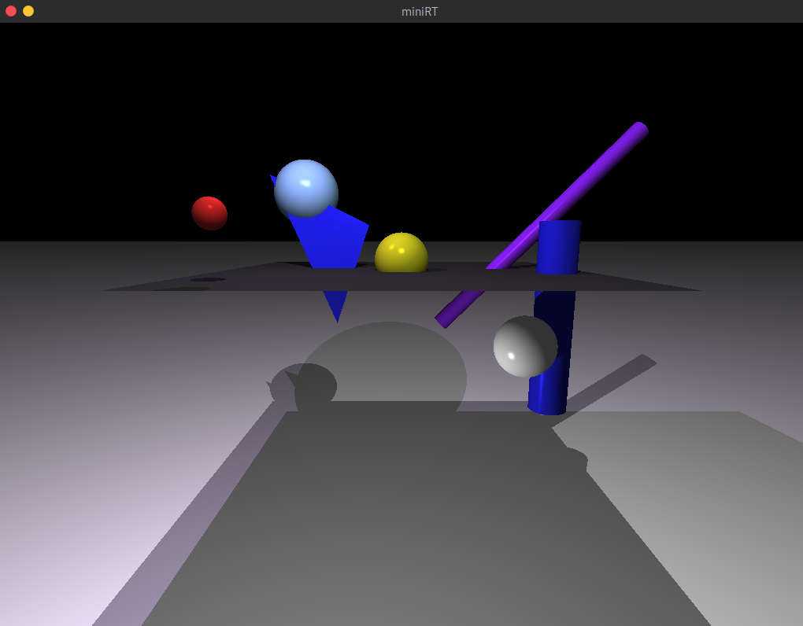

# miniRT

`miniRT` is an individual school project at [42 Paris](https://www.42.fr) campus.

42 is a private, non-profit and tuition-free Computer Science school based on peer-to-peer learning and hands-on projects.  
All programs written in C follow [42 style guideline](https://github.com/42Paris/norminette).

> This project is an introduction to the beautiful world of Ray tracing. Once completed you will be able to render simple Computer-Generated-Images and you will never be afraid of implementing mathematical formulas again.  
The goal of your program is to generate images using the Raytracing protocol. Those computer generated images will each represent a scene, as seen from a specific angle and position, defined by simple geometric objects, and each with its own lighting system.

<p align="center">
  
</p>

### Disclaimer

This project is a school assignment. It was done for **learning purposes** and is thus **not intended for production**.  
Don't copy. Learn.  

I gathered all the resources that were helpful in the `doc` directory. You can check it out but don't copy and paste code without understanding how it works.

### Prerequisites

This program was developed on Debian Linux. It runs on Debian and Ubuntu.

- GNU make and a C compiler
- libxext-dev and libbsd-dev packages (see `install` rule in Makefile)

### Dependencies

- [MinilibX for Linux](https://github.com/42Paris/minilibx-linux)
- [libft](https://github.com/matboivin/libft)
- [minimath](https://github.com/matboivin/minimath)

### Installing

Clone the repository and its dependencies:
```console
$ git clone --recursive https://github.com/matboivin/miniRT
```

Change it to your working directory and run:
```console
$ make install && make
```

### Usage

This program takes as a first argument a [scene description file](doc/scene_file.md) ending with the `.rt` extension. Example files are provided in the [scenes](scenes) directory.

```console
$ ./miniRT <scene.rt> [--save]

optional arguments:
  --save  save the rendered image in bmp format
```

### Common tasks

* Press `ESC` key to exit the program.
* Press space bar to switch view point in case of several cameras.

### Examples

```console
$ ./miniRT scenes/room.rt
$ ./miniRT scenes/smaug.rt
```
<p align="center">
  
  
</p>

`smaug.rt` file generated using [mesh converter](https://github.com/matboivin/miniRT-mesh-converter).

### License

<a rel="license" href="http://creativecommons.org/licenses/by-nc/4.0/"></a>

This work is licensed under a
[Creative Commons Attribution-ShareAlike 4.0 International License](http://creativecommons.org/licenses/by-nc/4.0/).

### Acknowledgements

School project done at [42 Paris](https://www.42.fr).
