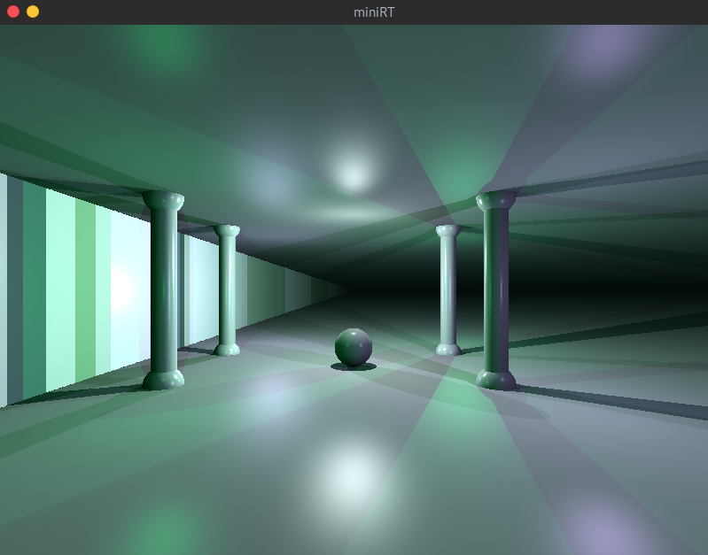

# miniRT

`miniRT` is an individual school project at [42 Paris](https://www.42.fr) campus.

42 is a private, non-profit and tuition-free Computer Science school based on peer-to-peer learning and hands-on projects.

> This project is an introduction to the beautiful world of Raytracing. Once completed you will be able to render simple Computer-Generated-Images and you will never be afraid of implementing mathematical formulas again.  

<p align="center">
  
</p>

| Program name      | miniRT                                                              |
| :---------------- | :------------------------------------------------------------------ |
| Turn in files     | All necessary files                                                 |
| Makefile          | all, clean, fclean, re, bonus                                       |
| External functs.  | - open, close, read, write, malloc, free, perror, strerror, exit<br/>- All functions of the math library<br/>- All functions of the MinilibX |
| Arguments         | A scene in format *.rt                                              |
| Libft authorized  | Yes                                                                 |
| Description       | The goal of your program is to generate images using the Raytracing protocol. Those computer generated images will each represent a scene, as seen from a specific angle and position, defined by simple geometric objects, and each with its own lighting system. |

### Prerequisites

GNU make and a C compiler.

### Dependencies

This program was developed and runs on Debian Linux.

- [MinilibX for Linux](https://github.com/42Paris/minilibx-linux)
- [libft](https://github.com/matboivin/libft)
- [minimath](https://github.com/matboivin/minimath)

### Installing

Clone the repository and its dependencies:
```console
$ git clone --recursive https://github.com/matboivin/miniRT
```

Change it to your working directory and run:
```console
$ make
```

### Usage

This program takes as a first argument a [scene description file](doc/scene_file.md) ending with the `.rt` extension. Example files are provided in the [scenes](scenes) directory.

```console
$ ./miniRT <scene.rt> [--save]

optional arguments:
  --save  save the rendered image in bmp format
```

### Example

```console
$ ./miniRT scenes/room.rt
```
<p align="center">
  
  
</p>

### Common tasks

* Press `ESC` key to exit the program.
* Press space bar to switch view point.

### Acknowledgements

School project done at [42 Paris](https://www.42.fr).
