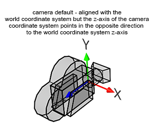
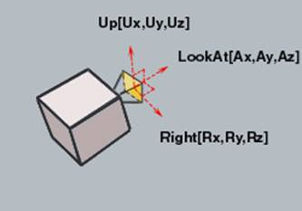
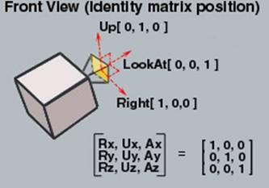
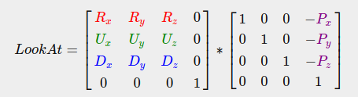
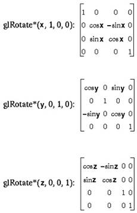
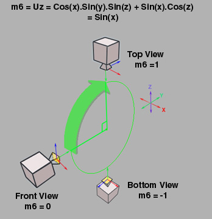
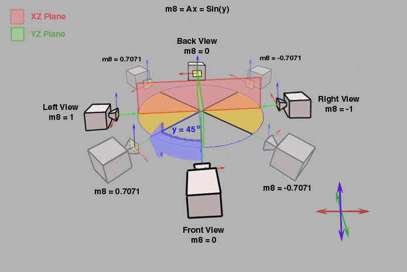

# Camera

## Orientation

  

> When you create a camera, it is by default aligned along the world coordinate system negative z-axis. This is a convention used by most 3D applications.

Source: [Scratchapixel: Camera Coordinate System and Camera Space](https://www.scratchapixel.com/lessons/3d-basic-rendering/computing-pixel-coordinates-of-3d-point/mathematics-computing-2d-coordinates-of-3d-points)

## camToWorld / lookAt

   

Source: [Interactive Techniques in Three-dimensional Scenes (Part 1)](https://www.codeproject.com/Articles/35139/Interactive-Techniques-in-Three-dimensional-Scenes)

> A great thing about matrices is that if you define a coordinate space using 3 perpendicular (or non-linear) axes you can create a matrix with those 3 axes plus a translation vector and you can transform any vector to that coordinate space by multiplying it with this matrix.

  

Source: [Learn OpenGL: Camera](https://learnopengl.com/Getting-started/Camera)

## Rotation

  

  

  

Source: [Interactive Techniques in Three-dimensional Scenes (Part 1)](https://www.codeproject.com/Articles/35139/Interactive-Techniques-in-Three-dimensional-Scenes)
