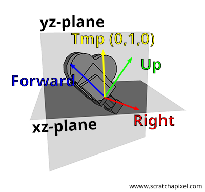

# Camera

- [Apprendre OpenGL moderne: Caméra](https://opengl.developpez.com/tutoriels/apprendre-opengl/?page=camera)
- [Learn openGL: Camera](https://learnopengl.com/Getting-started/Camera)
- [Interactive Techniques in Three-dimensional Scenes (Part 1)](https://www.codeproject.com/Articles/35139/Interactive-Techniques-in-Three-dimensional-Scenes)
- [Scratchapixel 2.0: Placing a Camera: the LookAt Function](https://www.scratchapixel.com/lessons/mathematics-physics-for-computer-graphics/lookat-function)

## Orientation

  

> When you create a camera, it is by default aligned along the world coordinate system negative z-axis. This is a convention used by most 3D applications.

Source: [Scratchapixel 2.0: Camera Coordinate System and Camera Space](https://www.scratchapixel.com/lessons/3d-basic-rendering/computing-pixel-coordinates-of-3d-point/mathematics-computing-2d-coordinates-of-3d-points)

## cam_to-world <-> world_to_cam

   

Image source: [Interactive Techniques in Three-dimensional Scenes (Part 1)](https://www.codeproject.com/Articles/35139/Interactive-Techniques-in-Three-dimensional-Scenes)

The LookAt function in OpenGL creates a view matrix that converts from World Space to Camera Space.

> A great thing about matrices is that if you define a coordinate space using 3 perpendicular (or non-linear) axes you can create a matrix with those 3 axes plus a translation vector and you can transform any vector to that coordinate space by multiplying it with this matrix.  
Source: [Learn OpenGL: Camera](https://learnopengl.com/Getting-started/Camera)

From the camera position, define 3 axis:
- Up
- Right
- Forward / LootAt / Dir

  

Image source: [Scratchapixel 2.0: Placing a Camera: the LookAt Function](https://www.scratchapixel.com/lessons/mathematics-physics-for-computer-graphics/lookat-function)

  

Image source: [Learn OpenGL: Camera](https://learnopengl.com/Getting-started/Camera)

Invert the world_to_cam matrix to get the cam_to-world matrix.

- [Inverting a 4x4 matrix](https://stackoverflow.com/questions/1148309/inverting-a-4x4-matrix)
- [Fast 4x4 Matrix Inverse with SSE SIMD, Explained](https://lxjk.github.io/2017/09/03/Fast-4x4-Matrix-Inverse-with-SSE-SIMD-Explained.html)
- [dCode: Inverse d'une Matrice](https://www.dcode.fr/inverse-matrice)

## Rotation

Rotation is handled by the matrix.

[Scale](https://www.khronos.org/registry/OpenGL-Refpages/gl2.1/xhtml/glScale.xml) > [Rotate](https://www.khronos.org/registry/OpenGL-Refpages/gl2.1/xhtml/glRotate.xml) > [Translate](https://www.khronos.org/registry/OpenGL-Refpages/gl2.1/xhtml/glTranslate.xml)

  

Decomposition of the rotation submatrix:

  

Moving the camera using spherical coordinates:

  
  

Images source: [Interactive Techniques in Three-dimensional Scenes (Part 1)](https://www.codeproject.com/Articles/35139/Interactive-Techniques-in-Three-dimensional-Scenes)

## FOV

A perspective projection demo: [Perspective Projections](http://learnwebgl.brown37.net/08_projections/projections_perspective.html)

Aspect ratio and FOV: [Scratchapixel 2.0: the Pinhole Camera Model](https://www.scratchapixel.com/lessons/3d-basic-rendering/3d-viewing-pinhole-camera/how-pinhole-camera-works-part-2)
