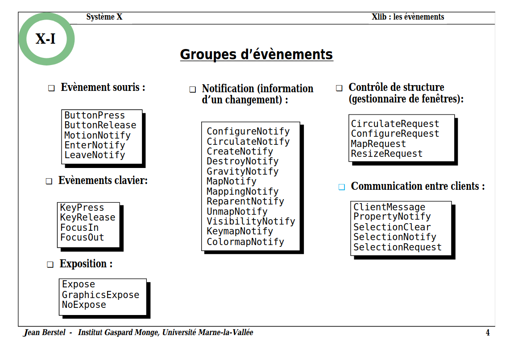

# Events

An event is an action, or occurence, the software needs to know about. They can be user actions (key press, mouse clicks), messages from other programs or threads. A event-driven program runs a loop to listen to events. When an event occurs, it calls a corresponding event handler (or event listener).

- [Wiki: Event (computing)](https://en.wikipedia.org/wiki/Event_(computing))
- [Wiki: Event-driven programming](https://en.wikipedia.org/wiki/Event-driven_programming)
- [Wiki: Event loop](https://en.wikipedia.org/wiki/Event_loop)

## X events

  

Source: [Xlib - les évènements (PDF)](http://www-igm.univ-mlv.fr/~berstel/Cours/Xlib/13-Evenements.pdf)
