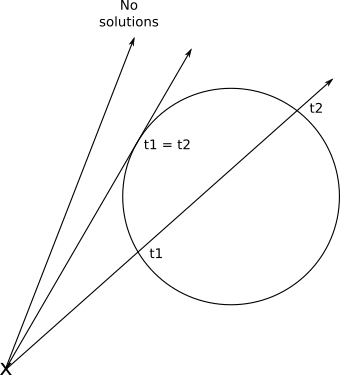
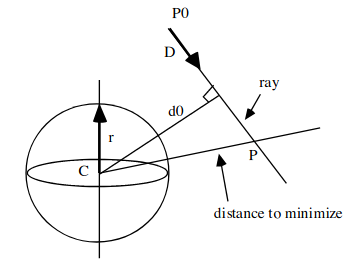
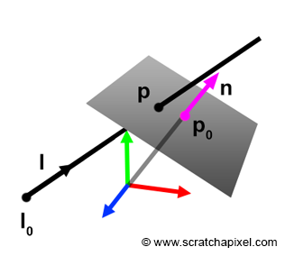
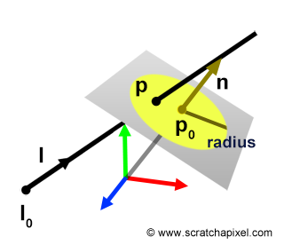
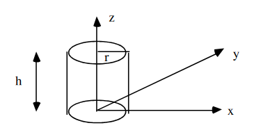

# Object intersections

[Primitives](https://en.wikipedia.org/wiki/Geometric_primitive) are simple geometric shapes such as a cube, cylinder, sphere, ...  
A [quadric](https://en.wikipedia.org/wiki/Quadric) is a surface in a (D + 1)-dimensional space.

> The class of quadrics (surfaces that can be defined by a quadratic equation) include cylinders, cones, ellipsoids, paraboloids, etc. Note that spheres and planes are a special subclass but have faster routines as special cases. For these we will use the parametric ray formulation and the implicit surface equation for the quadratics.  
The general quadric surface equation is  
`F(x, y, z) = Ax2 + By2 + Cz2 + Dxy+ Exz + Fyz + Gx + Hy + Iz + J = 0`  
Source: [Ray - Quadric Intersection](http://skuld.bmsc.washington.edu/people/merritt/graphics/quadrics.html)

Formula to compute the intersection point:

```
intersection point = ray origin + t * ray direction
```

When solving quadratic equation:

`A t^2 + B t + C = 0`

-> Discriminant: `d = sqrt(B^2 - 4 AC)`

```
b^2 - (4 * a * c)
```

<p align="center">
  
</p>

Image source: [Gabriel Gambetta](https://www.gabrielgambetta.com/computer-graphics-from-scratch/basic-ray-tracing.html)

- discriminant < 0 : there is no intersection
- discriminant == 0 : only one intersection
- discriminant > 0 : two intersections

Read more: [Graph and Roots of Quadratic Polynomial](https://www.cut-the-knot.org/Curriculum/Algebra/QuadraticPolynomial.shtml)

## Sphere

### World Space

<p align="center">
  
</p>

Image source: [Scratchapixel 2.0: Ray-Sphere Intersection](https://www.scratchapixel.com/lessons/3d-basic-rendering/minimal-ray-tracer-rendering-simple-shapes/ray-sphere-intersection)


A sphere embedded in a 3D space:

```
x^2 + y^2 + z^2 = 1

// Xc, Yc, Zc : sphere center
// Solving quadratic equation

a = ray dir.x^2 + ray dir.y^2 + ray dir.z^2
b = 2 * (ray dir.x * (ray origin.x - Xc) + ray dir.y * (ray origin.y - Yc) + ray dir.z * (ray origin.z - Zc))
c = ((ray origin.x - Xc)^2 + (ray origin.y - Yc)^2 + (ray origin.z - Zc)^2) - r^2

root1 = (-b + sqrt(det)) / (2 * a);
root2 = (-b - sqrt(det)) / (2 * a);

```
### Local Space

A function that generates the radius 1 sphere would be: `f(x,y,z)=x2+y2+z2−1`

`r` is the radius of the sphere:

```
   c1  c2  c3  c4

x [ r,  0,  0, T1]
y [ 0,  r,  0, T2]
z [ 0,  0,  r, T3]
w [ 0,  0,  0,  1]
```

## Plane

<p align="center">
  
</p>

Image source: [Scratchapixel 2.0: Ray-Plane and Ray-Disk Intersection](https://www.scratchapixel.com/lessons/3d-basic-rendering/minimal-ray-tracer-rendering-simple-shapes/ray-plane-and-ray-disk-intersection)

```
Ax + By + Cz + D = 0; 

// (A, B, C) : plane normal

t = - ((A*X + B*Y + C*Z + D) / (A*DIR.x + B*DIR.y + C*DIR.z))
// (X Y Z) = (O.x-pointplaneX O.y-pointplaneY O.z-pointplane.Z)
```

## Square, triangle and disk

<p align="center">
  
</p>

Image source: [Scratchapixel 2.0: Ray-Plane and Ray-Disk Intersection](https://www.scratchapixel.com/lessons/3d-basic-rendering/minimal-ray-tracer-rendering-simple-shapes/ray-plane-and-ray-disk-intersection)

1. Intersect with plane
2. Use side / vertices / radius to check if point is inside shape

## Cylinder

<p align="center">
  
</p>

Image source: [Cylinder-ray intersections](https://mrl.nyu.edu/~dzorin/rend05/lecture2.pdf)

### World Space

#### Infinite cylinder

```
x^2 + y^2 - r^2 = 0

// Solving quadratic equation

d = ray_pos - cyl_base_center
tmp_a = ray_dir - dot(ray_dir, cyl_dir) * cyl_dir
tmp_b = d - dot(d, cyl_dir) * cyl_dir

a = tmp_a^2
b = 2 * dot(tmp_a, tmp_b))
c = tmp_b^2 - r^2
```

Source: [Cylinder-ray intersections](https://mrl.nyu.edu/~dzorin/rend05/lecture2.pdf)

#### Finite cylinder without caps

Check if point is between zmin and zmax (or ymin and ymax).

zmin -> the center of the first base of the cylinder (bottom)
zmax -> the center of the second base of the cylinder (stop)

```
dot(ray_dir, hit_point - cyl_base_center) > 0
&&
dot(ray_dir, hit_point - cyl_top_center) < 0
```

#### Finite cylinder with caps

zmin -> center of first cap plane (bottom)
zmax -> center of second cap plane (top)

1. Intersect with each plane using the 2 centers.
2. Check whether the intersections are inside caps.

```
dot(ray_dir, hit_point - cyl_base_center) = 0, (point - cyl_base_center)^2 < r^2
&&
dot(ray_dir, hit_point - cyl_top_center) = 0, (hit_point - cyl_top_center)^2 < r^2
```

### Local Space

#### Infinite cylinder

Same process than a sphere but set the z axis (or y according to your coordinates system) to null.

`r` is the radius of the cylinder and `h` is the height of the cylinder:

```
   c1  c2  c3  c4

x [ r,  0,  0, T1]
y [ 0,  h,  0, T2]
z [ 0,  0,  r, T3]
w [ 0,  0,  0,  1]
```

#### Finite cylinder

The intersection is inside the cylinder if:

```
dot(ray_dir, N) > 0
```

Else, the intersection is outside.
