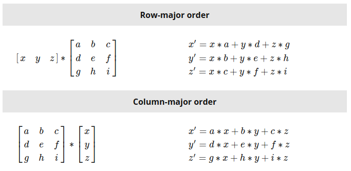
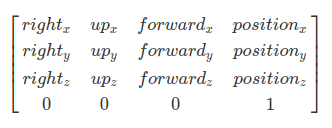

# Notes on Linear Algebra

[Linear algebra is a branch of mathematics that is fundamental to computer graphics.](http://math.hws.edu/graphicsbook/c3/s5.html) It studies vectors, linear transformations, and matrices.

- Linear transformations can be represented by 4x4 matrices.
- A point is a position in a 3D space.
- A vector is like a direction in a 3D space.
- Objects in 3D can be transformed using: **translation**, **rotation** and **scaling**.

[Scale](https://www.khronos.org/registry/OpenGL-Refpages/gl2.1/xhtml/glScale.xml) > [Rotate](https://www.khronos.org/registry/OpenGL-Refpages/gl2.1/xhtml/glRotate.xml) > [Translate](https://www.khronos.org/registry/OpenGL-Refpages/gl2.1/xhtml/glTranslate.xml)

## Vectors

- **Unit vectors** are vectors of length 1.
- A vector of length 1 is **normalized**. Normalising a vector means making the vector length become 1.
- To normalize the vector:
  - Get the length of a 3D vector (x,y,z): `len = sqrt(x2 + y2 + z2)`
  - Divide it by its length: `(x/len, y/len, z/len)`
  - The result is a unit vector  that points in the same direction as the original vector.

## 4x4 Matrix Visualized as a Cartesian Coordinate System

A matrix is a way of combining scaling, rotation, and translation into one single structure. A point multiplied by a matrix transforms the point to a new position. We translate, scale and rotate objects. These transformation are represented by a 4x4 matrix which can be visualised as a coordinate system.

- [Apprendre OpenGL moderne: Transformations](https://opengl.developpez.com/tutoriels/apprendre-opengl/?page=transformations)

<p align="center">
  
</p>

> The first three coefficients along the diagonal encode the scale (the coefficients c00, c11 and c22).  
Source: [Scratchapixel 2.0: Computing the Pixel Coordinates of a 3D Point](https://www.scratchapixel.com/lessons/3d-basic-rendering/computing-pixel-coordinates-of-3d-point/perspective-projection)

```
   c1  c2  c3  c4

x [Rx, Ux, Fx, Tx]
y [Ry, Uy, Fy, Ty]
z [Rz, Uz, Fz, Tz]
w [0., 0., 0., 1.]

// scaling

x [ s,  0,  0,  0]
y [ 0,  s,  0,  0]
z [ 0,  0,  s,  0]
w [ 0,  0,  0,  1]
```

<p align="center">
  
</p>

Image source: [Scratchapixel 2.0: Row Major vs Column Major Vector](https://www.scratchapixel.com/lessons/mathematics-physics-for-computer-graphics/geometry/row-major-vs-column-major-vector)

Column-major matrix:

<p align="center">
  
</p>

Image source: [Understanding the View Matrix](https://www.3dgep.com/understanding-the-view-matrix/)

> When working with OpenGL it is very wise to stick with homogeneous coordinates. For 3D space these are 4D vectors where normally the fourth element equals 1. When you do this all your calculations are in 4 dimensional space, so no conversions needed anywhere.  
Also note that in your example, you will actually lose any translation that may have been recorded in the transformation matrix. If you want to keep this you'll need to use 1 for the 4th element, not 0 ([source](https://stackoverflow.com/questions/36358621/multiply-vec3-with-mat4-using-glm)).
