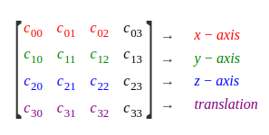
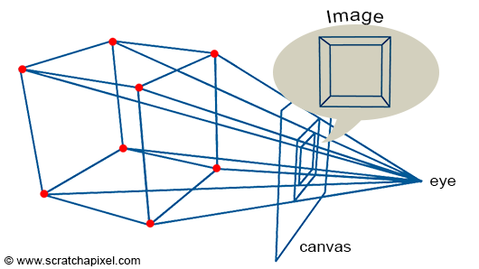
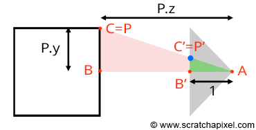

# Notes on Linear Algebra

[Linear algebra is a branch of mathematics that is fundamental to computer graphics.](http://math.hws.edu/graphicsbook/c3/s5.html) It studies vectors, linear transformations, and matrices.

- Linear transformations can be represented by 4x4 matrices.
- A point is a position in a 3D space.
- A vector is like a direction in a 3D space.
- A point multiplied by a matrix transforms the point to a new position.
- Objects in 3D can be transformed using: **translation**, **rotation** and **scaling**.

## Vectors

- **Unit vectors** are vectors of length 1.
- A vector of length 1 is **normalised**. Normalising a vector means making the vector length become 1.
- To normalize the vector, divide it by its length: `(x/len, y/len, z/len)`
  - Get the length of a 3D vector (x,y,z): `len = sqrt(x2 + y2 + z2)`
  - The result is a unit vector  that points in the same direction as the original vector.

## 4x4 Matrix Visualized as a Cartesian Coordinate System

> Rotation and scaling are linear transformations, but translation is not a linear transformation. To include translations, we have to widen our view of transformation to include affine transformations. An affine transformation can be defined, roughly, as a linear transformation followed by a translation. Geometrically, an affine transformation is a transformation that preserves parallel lines; that is, if two lines are parallel, then their images under an affine transformation will also be parallel lines. For computer graphics, we are interested in affine transformations in three dimensions. However—by what seems at first to be a very odd trick—we can narrow our view back to the linear by moving into the fourth dimension.  
An affine transformation is represented as a 4-by-4 matrix in which the bottom row is (0,0,0,1), and a three-dimensional vector is changed into a four dimensional vector by adding a 1 as the final coordinate. The result is that all the affine transformations that are so important in computer graphics can be implemented as multiplication of vectors by matrices.

Souce: [Some Linear Algebra](http://math.hws.edu/graphicsbook/c3/s5.html)

  

Source: [Scratchapixel: Computing the Pixel Coordinates of a 3D Point](https://www.scratchapixel.com/lessons/3d-basic-rendering/computing-pixel-coordinates-of-3d-point/perspective-projection)

### Perspective Projection

  

Source: [Scratchapixel: Computing the Pixel Coordinates of a 3D Point](https://www.scratchapixel.com/lessons/3d-basic-rendering/computing-pixel-coordinates-of-3d-point/perspective-projection)

  

> The coordinates of the point P', the projection of P on the canvas can be computed using simple geometry. The rectangle ABC and AB'C' are said to be similar (side view).  
Points in a scene are defined in the world coordinate space. However to project them onto the surface of the canvas, we first need to convert the 3D point coordinates from world space to camera space. This can be done by multiplying the point world coordinates by the inverse of the camera-to-wold matrix. 

Source: [Scratchapixel: Mathematics of Computing the 2D Coordinates of a 3D Point](https://www.scratchapixel.com/lessons/3d-basic-rendering/computing-pixel-coordinates-of-3d-point/mathematics-computing-2d-coordinates-of-3d-points)
