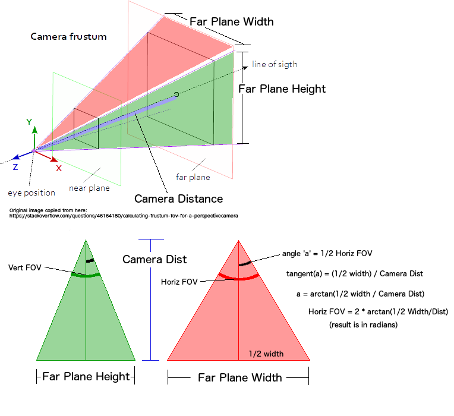
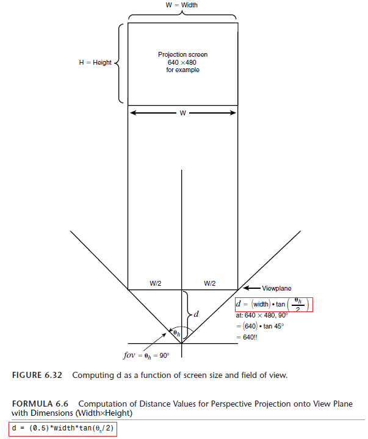

# Viewing frustum

[Wiki: Viewing frustum](https://en.wikipedia.org/wiki/Viewing_frustum)

Any object contained within the frustum (or overlapping it) is visible and will show up on the image ([source](https://www.scratchapixel.com/lessons/3d-basic-rendering/get-started)).

  

Images source: [ThreeJS: Calculating FOV for perspective camera after browser window resize](https://stackoverflow.com/questions/47184264/threejs-calculating-fov-for-perspective-camera-after-browser-window-resize)

  

Images source: [Perspective projection view plane distance calculation confusion?](https://stackoverflow.com/questions/36251087/perspective-projection-view-plane-distance-calculation-confusion)
